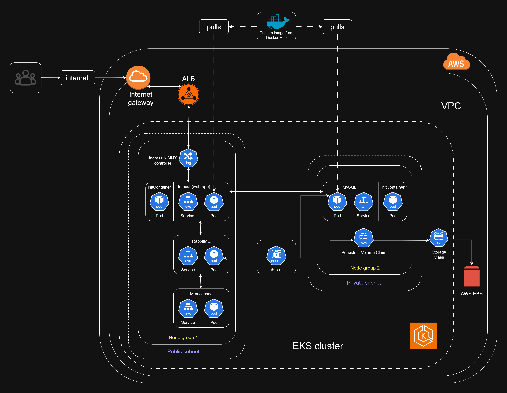

#  Project 2: Kubernetes Deployment of Multi-Service Java Application on AWS EKS

[](#)
[](#)
[](#)

---

##  Part of a 3-Project DevOps Progression

This project is the **second milestone** in a self-designed 3-part DevOps portfolio projects designed to mirror the progression of infrastructure maturity in real-world engineering environments — from containerization, to orchestration, to full automation and observability on real world cloud infrastructure.

- **Project 1**: Multi-service containerization and deployment using Docker Compose on AWS EC2 - [Project 1](https://github.com/ravi-rajyaguru15/Project-01-dockerized-multi-service-application)
- **Project 2 (this)**: Kubernetes orchestration of the same application stack on AWS EKS  
- **Project 3**: Infrastructure-as-Code with Terraform, CI/CD via GitHub Actions, and monitoring using Prometheus and Grafana - [Project 3](https://github.com/ravi-rajyaguru15/Project-03-terraform-cicd-observability-pipeline)

---

##  Project Overview

This project transitions a previously containerized, multi-service Java web application (from Project 1) into a **modular, production-style Kubernetes deployment** on AWS. The focus here is on orchestration, service networking, persistent storage, and secure credential handling — all managed via **declarative Kubernetes manifests**.

Runs fully on **AWS Elastic Kubernetes Service (EKS)** provisioned via `eksctl` with integrated support for IAM roles and EBS CSI drivers. Custom Docker images for the core services are built and pulled from Docker Hub registry, while service dependencies are tightly managed using `initContainers`. The app is publicly exposed using an **NGINX Ingress Controller**, integrated with AWS load balancing. 

This project demonstrates a real-world transition from local container coordination (Docker Compose) to **cloud-native orchestration** using Kubernetes on AWS.

---

##  Application Stack

| Layer      | Component        | Purpose                                  |
|------------|------------------|------------------------------------------|
| Web        | `web-app`        | Java web app via Tomcat (+ Maven build)  |
| Database   | `mysql`          | PVC-backed relational Database           |
| Messaging  | `rabbitmq`       | Queue-based messaging                    |
| Caching    | `memcached`      | In-memory caching layer                  |
| Ingress    | `nginx`          | HTTP routing & reverse proxy             |

---

##  Infrastructure Overview (AWS)

- EKS Cluster with 2 managed node groups (created via eksctl)
- VPC with subnets, route tables, security groups (automatically managed by eksctl)
- Elastic Block Store (EBS) for persistent storage
- IAM role + EBS CSI Driver manually configured to allow PVC binding

---

## Architecture Overview



---

## Repository Structure

```text
Project_02/
│      
├── kubernetes/
│   ├── deployments/                               # Pods for app, mysql, rabbitmq, memcached 
│   │   ├── app-deployment.yaml                      and initContainers
│   │   ├── mysql-deployment.yaml
│   │   ├── rabbitmq-deployment.yaml
│   │   └── memcached-deployment.yaml
│   │
│   ├── services/                                  # ClusterIP services      
│   │   ├── web-app-service.yaml
│   │   ├── mysql-service.yaml
│   │   ├── rabbitmq-service.yaml
│   │   └── memcached-service.yaml
│   │
│   ├── ingress/                                   # NGINX ingress resource
│   │   └── nginx-ingress.yaml
│   │
│   ├── secrets/                                   # Base64 encoded secrets containing MySQL 
│   │   └── secrets.yaml                             and RabbitMQ credentials
│   │
│   └── persistentVolumeClaim/                     # MySQL PVC
│       └── mysql-pvc.yaml
│      
├── images/
|   ├── screenshots/...                            
│   └── architecture/
|         └── project-2-architecture.png 
│      
├── legacy/                                        # Files and artifacts carried over from project 1  
│   ├── app/...                                      for continuity purposes, but are not an active  
│   ├── mysql/...                                    part of project 2.
│   ├── nginx/...
│   ├── images/...                         
│   ├── .env                                                                           
│   └── docker-compose.yaml  
│                                 
├── project2-eksctl-config.yaml                    # Cluster definition configuration file for eksctl     
└── README.md                                      # Project README (You are here) (Inception!)
```
---

## How to Deploy (Reproduction steps)

1.  **Prerequisites/Dependencies**:
      - Local machine with `aws-cli`, `eksctl`, `kubectl`, and `git` installed
      - AWS account configured via aws cli, and with appropriate IAM user, and access rights. 
2. Open the bash terminal and fetch the project files via git clone, and navigate into the project folder.
3. Create EKS cluster:
    ```bash
    eksctl create cluster -f project2-eksctl-config.yaml
    ```
4. Connect to the cluster and get node information:
    ```bash
    aws eks update-kubeconfig --region us-east-1 --name project2-eks-cluster
    ```
    ```bash
    kubectl get nodes
    ```
5. Install NGINX Ingress Controller and verify its pods and services:
    ```bash
    kubectl apply -f https://raw.githubusercontent.com/kubernetes/ingress-nginx/controller-v1.10.1/deploy/static/provider/aws/deploy.yaml
    ```
    ```bash
    kubectl get pods -n ingress-nginx
    kubectl get svc -n ingress-nginx
    ```
6. Apply Kubernetes Manifests:
    ```bash
    kubectl apply -f kubernetes/secrets/
    kubectl apply -f kubernetes/persistentVolumeClaim/
    kubectl apply -f kubernetes/deployments/
    kubectl apply -f kubernetes/services/
    kubectl apply -f kubernetes/ingress/
    ```
7. Verify Deployment:
    ```bash
   kubectl get pods
   kubectl get pvc
   kubectl get all
    ```
8. Access the web-application using the DNS endpoint form ingress nginx service: 
    ```bash
    # Locate EXTERNAL-IP of ingress-nginx service
    
    kubectl get svc -n ingress-nginx
    ```
8. After verification of web app, terminate and clean the eks cluster and VPC to avoid incurring unnecessary AWS costs:
    ```bash
    eksctl delete cluster   --name project2-eks-cluster
    ```
    ```bash
    # here node eviction is disabled as one of the pods is covered by PodDisruptionBudget (PDB) so eviction API does not let that pod to be evicted resulting in cluster deletion being stuck in this phase. This is the alternate way to delete cluster.
    
    eksctl delete cluster \
    --name project2-eks-cluster \
    --region us-east-1 \
    --disable-nodegroup-eviction \
    --force
    ```   
---

## Engineering Insights

- **Declarative Manifests**: All Kubernetes resources were defined using raw YAML manifests without Helm or third-party abstractions. This ensured complete visibility and control over each resource, which was critical in debugging and refining cluster behavior during development.
- **PVC Binding Automation**: EBS volumes required manual CSI driver and IAM configuration; automated this to ensure smooth pod startup.
- **initContainer Usage**:
	 - In mysql: removes lost+found directory from EBS to prevent startup failure
	 - In web-app: waits for MySQL, RabbitMQ, and Memcached to become ready beforehand
- **Custom Dockerhub registry Images**: Custom images for web-app and database built, tagged, and pushed to Docker Hub — ensures reproducibility and ownership
- **Debugging Experience**: Faced issues like CrashLoopBackOff, PVC mount errors, IAM permission errors — all resolved hands-on

---

## What This Project Demonstrates

- Proficiency in Kubernetes fundamentals and cloud native orchestration on AWS EKS infrastructure.
- Solid understanding of pods, services, ingress, secrets, volumes, VPC, subnets, etc.
- Real-world problem-solving and debugging (PVC, IAM, image pulls).
- Attention to security, modularity, and production readiness, and cost awareness.
- Artifact and image lifecycle ownership through private Docker Hub repos.

---

## Attribution

The Java web application used in this project was externally sourced. All containerization, orchestration, deployment strategy, and infrastructure setup were independently implemented. Although it being way out of scope, and to ensure the system appeared more production-ready and portfolio-appropriate, all course-specific branding was removed; UI elements and presentation were modified to reflect a generic, open-source-style web application. 

A delibrate and calculated decision was also made to use the same web apllication throughout all 3 projects. This allowed full attention to be directed towards infrastructure, deployment, and DevOps process engineering.

---